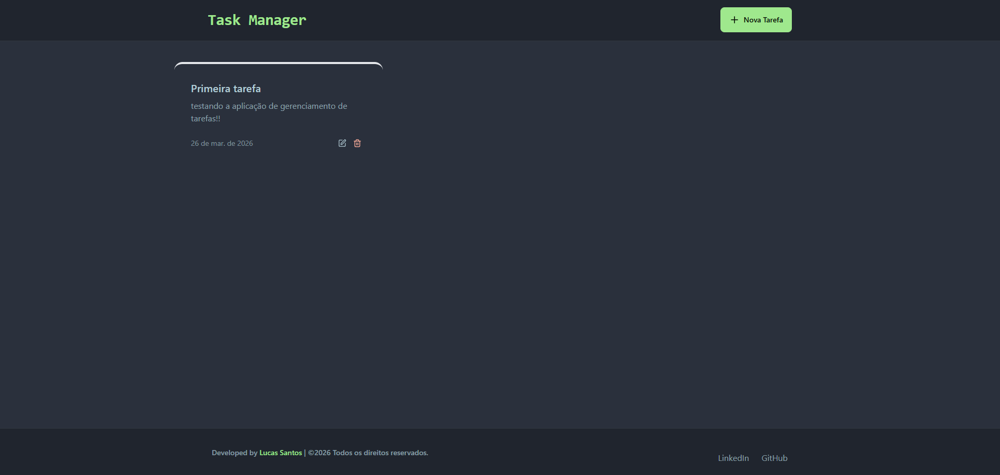
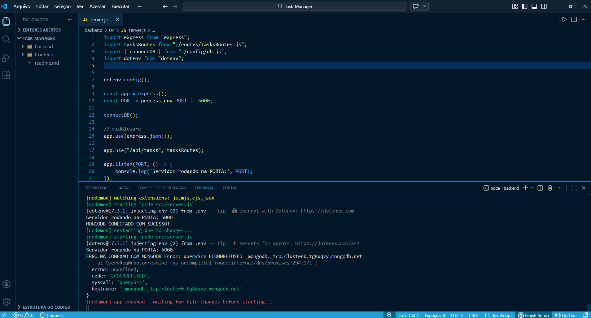
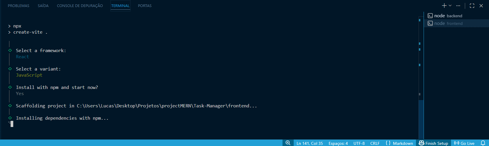
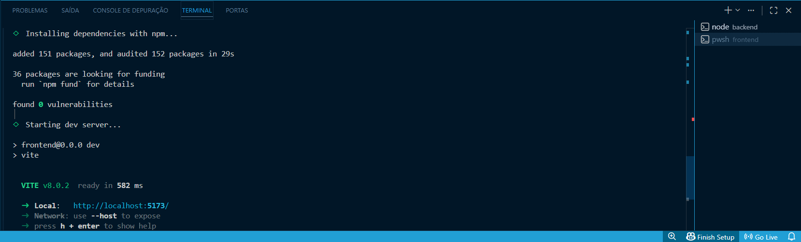

# **Task Manager com MERN Stack**

<br/>

<div align="center">
    
    
    
    
    
    
    
</div>

<br/>
<br/>


## **Introdução:**

### Task Manager em localhost:



---

O que é **MERN**?

MERN é um acrônimo que representa um conjunto de tecnologias baseadas em JavaScript usadas para desenvolver aplicações web e móveis de pilha completa (full stack).     
O nome vem das quatro tecnologias principais:

- **MongoDB**: Banco de dados NoSQL orientado a documentos, que armazena dados no formato JSON.

- **Express.js**: Framework leve para construção de aplicações web e APIs no lado do servidor, rodando sobre Node.js. 

- **React**: Biblioteca JavaScript para criar interfaces de usuário dinâmicas e responsivas, amplamente usada em front-end. 

- **Node.js**: Ambiente de tempo de execução que permite executar JavaScript fora do navegador, no lado do servidor. 

A Stack MERN é popular porque permite que desenvolvedores usem apenas uma linguagem **(JavaScript)** em todo o processo de desenvolvimento, desde o front-end passando pelo back-end indo até o banco de dados, o que simplifica o aprendizado, aumenta a produtividade e facilita a manutenção de código. Estas tecnologias são amplamente utilizadas no mercado de trabalho, especialmente em projetos que exigem aplicativos web modernos, escaláveis e com interações ricas, como no caso deste projeto.

---

### **Desenvolvimento da aplicação:** 

A Aplicação foi desenvolvido seguindo padrões sólidos de software development, abaixo listo algumas regras específicas:     
- Validação de requisições HTTP utilizando middlewares no ``Express``.
- Padronização de respostas com ``Status Codes``.
- Validação de dados no MongoDB utilizando ``Mongoose Schemas``.

Aplicação full-stack utilizando MERN Stack:
- Frontend em React com gerenciamento de estado via Hooks.
- Backend em Node.js com Express.
- Banco de dados MongoDB.

Implementação de operações CRUD completas para gerenciamento de tarefas:
- Criação de tarefas com validação de título e descrição.
- Atualização parcial e total (PATCH/PUT).
- Exclusão com verificação de existência.

API REST seguindo boas práticas:
- Uso correto de verbos HTTP.
- Estrutura de endpoints orientada a recursos.
- Respostas em JSON.
- Tratamento centralizado de erros.


Implementação de rate limiting para proteção contra abuso de API:
- Limitação de requisições com Upstash Redis.

Interface de Usuário responsiva desenvolvida com CSS Flexbox/Grid, adaptável para dispositivos móveis e desktop

---

### **Stack Tecnologicas:**

Tecnologias utilizadas:

- MongoDB
- Upstash Redis
- NodeJS (backend)
- React (library)
- Express (framework)
- Vite (build tool)
- Tailwind (framework)

---

### **Implementação:**

Configurações do backend (`/backend`):

```
MONGO_URI=<seu_mongo_uri>

UPSTASH_REDIS_REST_URL=<seu_redis_rest_url>
UPSTASH_REDIS_REST_TOKEN=<seu_redis_rest_token>

NODE_ENV=development
```


Rode o Backend:

```
cd backend
npm install
npm run dev
```


Caso apareça a seguinte mensagem de erro no terminal:        

---
      

---

Inclua o código abaixo em (`/backend/src/server.js`):

```
import { setServers } from 'node:dns/promises';

setServers(['1.1.1.1', '8.8.8.8']);   // Forçar o uso de DNS públicos no código Caso "Error: querySrv ECONNREFUSED"
```


Rode o Frontend:

```
cd frontend
npm create vite@latest .

Selecione "React" como framework

Selecione "Javascript" como variante
```

---


---

Se estiver utilizando a ultima versão do npm o servidor se iniciara automaticamente:

---


---

📚 Projeto inspirado no bootcamp da [FreeCodeCamp](https://www.youtube.com/watch?v=F9gB5b4jgOI) solidificando minha trilha de aprendizagem em Desenvolvimento MERN Full-Stack.